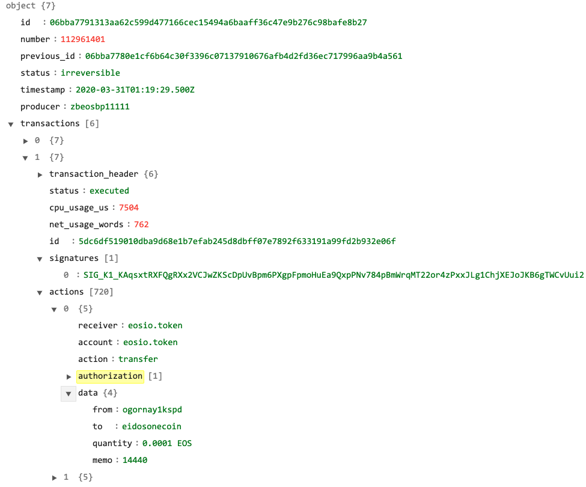

# Introduction

This `trace_api_plugin` can supply human readable JSON for every actions and no need to handle the deserialization by yourself. 

This plugin is designed to persist actions traces from all accounts and add more useful properties for DApps & Wallets. 





## Building the plugin [Install on your nodeos server]

```
cd eos/plugins/

# for EOSIO 2.0
rm -rf trace_api_plugin

# for non-EOSIO 2.0

git clone https://github.com/oldcold/trace_api_plugin.git

# edit eos/plugins/CMakeLists.txt and add the line:
add_subdirectory(trace_api_plugin)

# edit eos/programs/nodeos/CMakeLists.txt and add the line
target_link_libraries( nodeos PRIVATE -Wl,${whole_archive_flag} trace_api_plugin -Wl,${no_whole_archive_flag} )
```

## How to setup on your nodeos
Enable this plugin using --plugin option to nodeos or in your config.ini. Use nodeos --help to see options used by this plugin. 

```
validation-mode = light
chain-threads = 2
net-threads = 4
abi-serializer-max-time-ms = 1000
http-max-response-time-ms = 3000
trace-minimum-irreversible-history-blocks = 30000
plugin = eosio::trace_api_plugin
```

## Notice
`trace-rpc-abi` & `trace-no-abis` are disabled compared with original implementation.  

